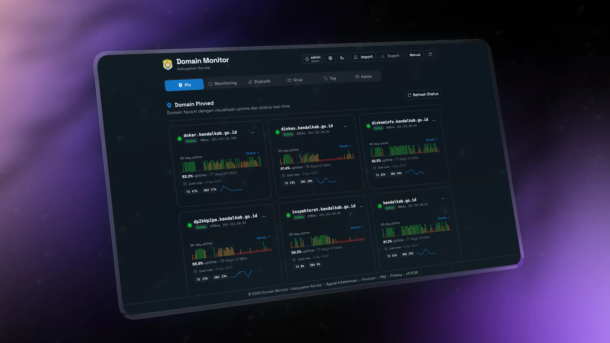
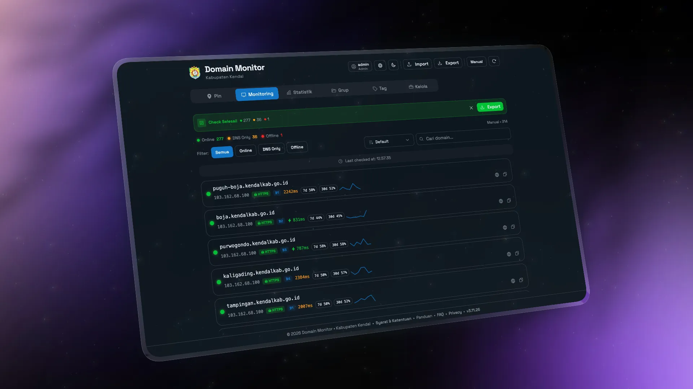
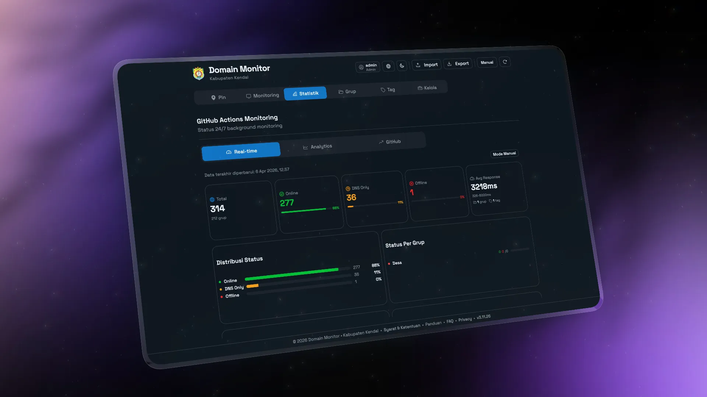
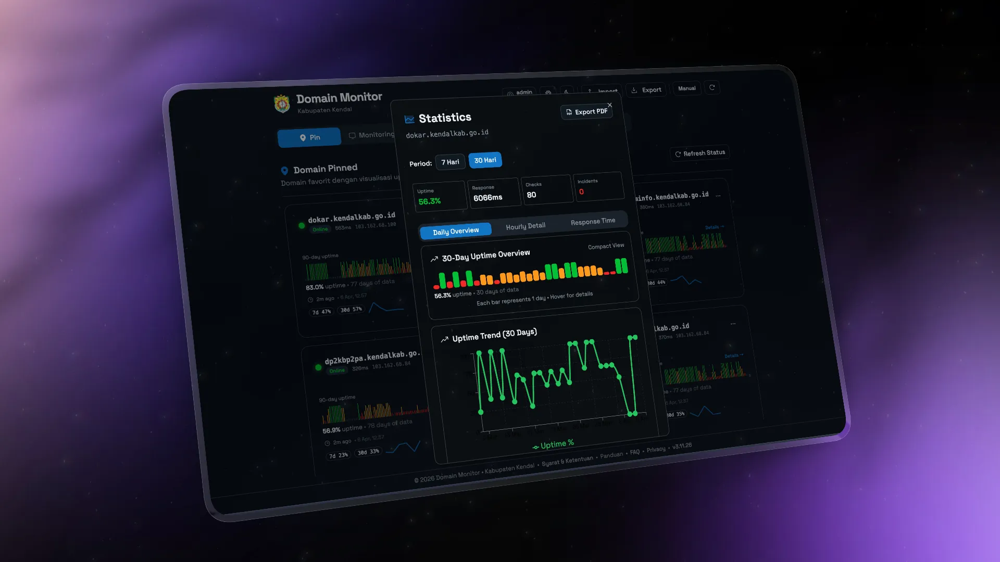
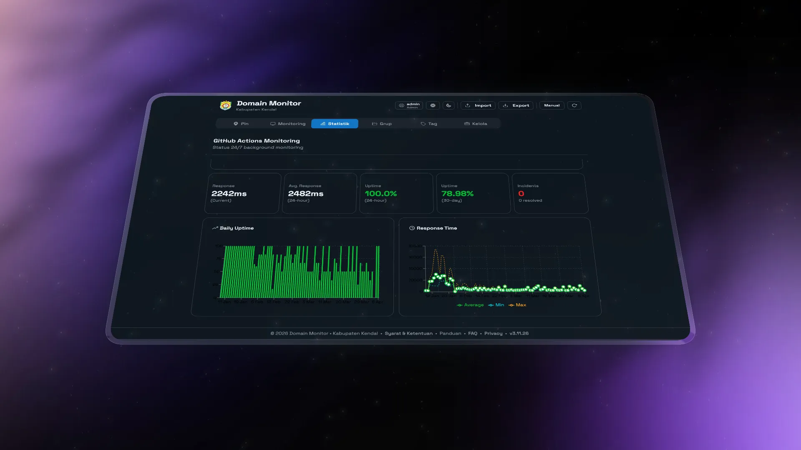
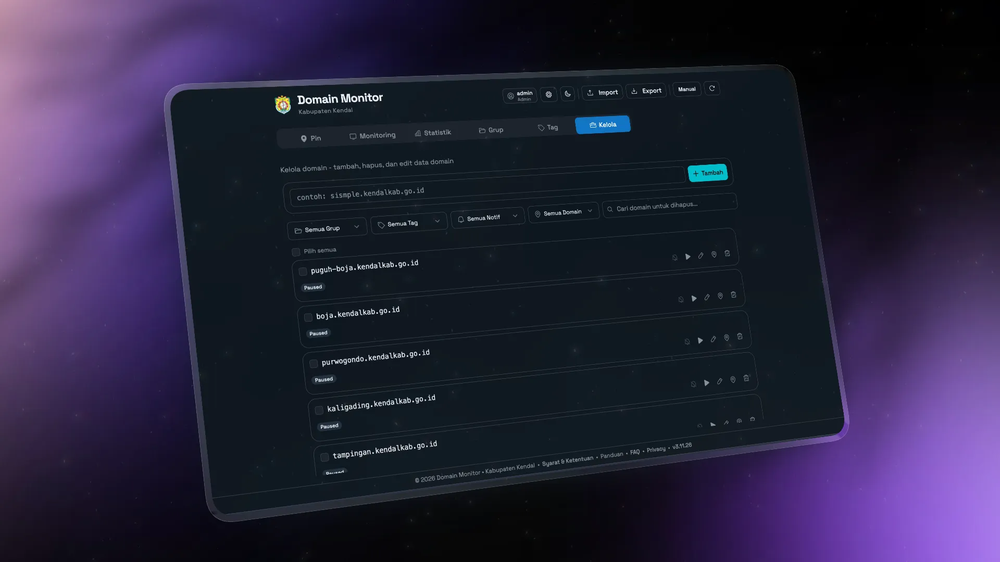

# Domain Monitor Dashboard

Dashboard monitoring availability domain/subdomain dengan Firebase sync, statistik uptime, notifikasi Slack, dan role-based access.

| Link            | Value                                       |
| --------------- | ------------------------------------------- |
| Demo URL        | https://domain-watchtower.vercel.app        |
| Current Version | 3.11.33                                     |
| Runtime         | React 19 + TypeScript + Vite 7 + Tailwind 4 |

- Current Version: 3.11.33

## Preview

<table>
  <tr>
    <td></td>
    <td></td>
  </tr>
  <tr>
    <td align="center"><sub>Pin dashboard</sub></td>
    <td align="center"><sub>Monitoring list</sub></td>
  </tr>
  <tr>
    <td></td>
    <td></td>
  </tr>
  <tr>
    <td align="center"><sub>Statistics overview</sub></td>
    <td align="center"><sub>Statistics detail</sub></td>
  </tr>
  <tr>
    <td></td>
    <td></td>
  </tr>
  <tr>
    <td align="center"><sub>Uptime chart</sub></td>
    <td align="center"><sub>URL management</sub></td>
  </tr>
</table>

---

## Demo Readonly

Secara default aplikasi membootstrap user demo readonly:

- Username: `demoakun`
- Password: `demo123456`
- Role: `viewer` (hanya lihat data, tidak bisa edit/delete/manage user)

Opsional override via env:

- `VITE_DEMO_VIEWER_USERNAME`
- `VITE_DEMO_VIEWER_PASSWORD`

---

## Quick Start

```bash
npm install
npm run dev
```

Build production:

```bash
npm run build
npm run preview
```

## Highlights

- Pin dashboard untuk domain favorit.
- Monitoring list dengan status realtime.
- Statistik uptime (overview dan detail).
- Uptime chart harian/jam.
- URL management untuk tambah/edit/hapus domain.

---

## Fitur Utama

### Monitoring

- 3-state status: `online`, `dns-only`, `offline`
- Manual bulk check + progress counter
- Auto-refresh + batch staggered checking
- Statistik harian/jam + incident tracking
- Export laporan PDF per domain

### User & Permission

- Login username + password
- Role: `admin`, `viewer`, `add-only`
- Guard permission pada aksi mutasi (edit/delete/pin/toggle monitoring)
- Admin bisa kelola user dari UI

### Integrasi

- Firebase Firestore sync (domains/groups/tags/stats)
- GitHub Actions cron monitoring
- Slack webhook notification (down/recovery/slow)

---

## Setup Firebase

1. Buat project Firebase dan aktifkan Firestore.
2. Salin file `.env.example` menjadi `.env`, lalu isi semua variabel `VITE_FIREBASE_*` untuk frontend.
3. Deploy rules:

```bash
npm run firebase:login
npm run firebase:rules:deploy
```

4. Pastikan struktur dokumen utama tersedia:

- `domains/default-user`
- `groups/default-user`
- `tags/default-user`
- `users/default-user`

5. Aktifkan Firebase Authentication (Email/Password) jika ingin mode auth penuh.

Variabel env frontend (lokal + Vercel):

- `VITE_FIREBASE_API_KEY`
- `VITE_FIREBASE_AUTH_DOMAIN`
- `VITE_FIREBASE_PROJECT_ID`
- `VITE_FIREBASE_STORAGE_BUCKET`
- `VITE_FIREBASE_MESSAGING_SENDER_ID`
- `VITE_FIREBASE_APP_ID`
- `VITE_FIREBASE_MEASUREMENT_ID`
- `VITE_DEFAULT_ADMIN_PASSWORD`
- `VITE_DEMO_VIEWER_USERNAME`
- `VITE_DEMO_VIEWER_PASSWORD`

---

## Setup GitHub Actions Monitoring

Workflow utama: [.github/workflows/monitor-domains.yml](.github/workflows/monitor-domains.yml)

Schedule default: setiap 1 jam (`cron: '0 * * * *'`).

Set repository secrets berikut:

- `FIREBASE_API_KEY`
- `FIREBASE_AUTH_DOMAIN`
- `FIREBASE_PROJECT_ID`
- `FIREBASE_STORAGE_BUCKET`
- `FIREBASE_MESSAGING_SENDER_ID`
- `FIREBASE_APP_ID`
- `FIREBASE_MEASUREMENT_ID`
- `FIREBASE_SERVICE_ACCOUNT` (recommended)
- `FIREBASE_CRON_EMAIL` dan `FIREBASE_CRON_PASSWORD` (fallback jika tanpa service account)
- `SLACK_WEBHOOK_URL` (optional)

Catatan:

- `scripts/monitor-cron.js` dan `scripts/verify-admin-auth.mjs` sekarang mewajibkan semua variabel `FIREBASE_*` di atas. Tidak ada fallback hardcoded lagi.

Set repository variables (optional):

- `MONITORING_ENABLED=true`
- `MONITORING_PAUSE_UNTIL=`
- `MONITORING_QUOTA_GRACEFUL_EXIT=true`
- `STATS_HEARTBEAT_HOURS=12`

---

## Setup Slack Notification

1. Buat Incoming Webhook di Slack.
2. Simpan URL ke secret `SLACK_WEBHOOK_URL` untuk cron server-side.
3. Untuk notification dari UI, buka Settings > Notification dan isi webhook.
4. Aktifkan toggle `Enable Notifications` per domain.

Jenis alert:

- Down
- Recovery
- Slow response

---

## Deploy (Vercel)

```bash
vercel --prod
```

Endpoint API server-side check:

- `POST /api/check-domains`

Endpoint ini dipakai manual `Check All` agar hasil tidak tergantung jaringan laptop user.
Endpoint ini juga dibatasi di server menjadi maksimal 2 request per 60 detik per client, sehingga user tidak bisa spam manual check terus-menerus.

---

## Biaya & Free Tier

Secara umum project ini bisa dijalankan dengan biaya sangat rendah, dan untuk skala kecil-menengah biasanya masih bisa di level gratis.

- Vercel: bisa deploy di plan gratis untuk frontend + serverless endpoint ringan (`/api/check-domains`).
- Firebase: bisa mulai dari free tier, tetapi tetap perlu monitor kuota bulanan (Firestore read/write/storage + Auth usage).
- GitHub Actions monitoring: pada akun/repo tertentu bisa berjalan gratis, tetapi batas menit/billing tergantung kebijakan plan GitHub Anda.

Rekomendasi operasional:

- Mulai dari free tier dulu.
- Nyalakan scheduler secukupnya (misalnya 1x/jam seperti default).
- Pantau usage tiap bulan di dashboard Firebase, Vercel, dan GitHub.
- Jika trafik/domain makin banyak, baru naikkan plan secara bertahap.

Intinya: mayoritas setup bisa jalan di tier gratis, selama penggunaan masih dalam batas kuota platform.

---

## Struktur Proyek

```text
src/
  App.tsx
  components/
  hooks/
  lib/
api/
  check-domains.js
docs/
  NOW.md
  CHANGELOG.md
  GUIDES.md
scripts/
  monitor-cron.js
```

---

## Dokumentasi

- [docs/NOW.md](docs/NOW.md)
- [docs/CHANGELOG.md](docs/CHANGELOG.md)
- [docs/GUIDES.md](docs/GUIDES.md)

---

## Security Notes

- Jangan commit file `.env*`.
- Simpan credential di GitHub Secrets / Vercel Environment Variables.
- Cek [SECURITY.md](SECURITY.md) untuk disclosure policy.
