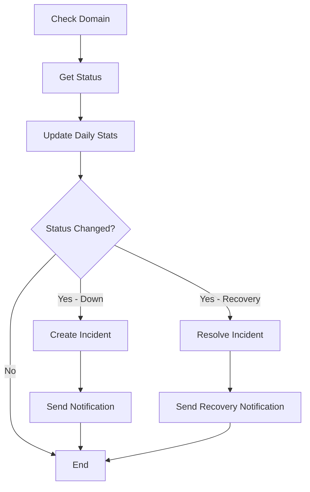

# Staggered Auto-Check System Guide

> **Doc Class:** Historical Staggered Monitoring Guide  
> **Trust Level:** Archive Reference (not source of truth)  
> **Last Reviewed:** 18 Februari 2026  
> **Source of Truth:** `PROJECT-STATUS.md` + `GITHUB-ACTIONS-USAGE.md`

## 📋 Overview

Sistem auto-check terbaru (v2.3.0) menggunakan strategi **staggered batch checking** untuk mengatasi limitasi Firebase free tier saat memonitor 300-400 domain secara bersamaan.

## 🎯 Key Features

### 1. Batch System
Domain dibagi ke dalam 4 batch secara otomatis menggunakan round-robin:
- **Batch 1**: Check pada menit 0, 20, 40
- **Batch 2**: Check pada menit 5, 25, 45  
- **Batch 3**: Check pada menit 10, 30, 50
- **Batch 4**: Check pada menit 15, 35, 55

Setiap domain akan dicek **3 kali per jam** (setiap 20 menit) = **72 checks per hari**.

### 2. Smart Storage
Data disimpan dengan 2 strategi:

#### Daily Stats (`domain-stats-daily`)
```typescript
{
  id: "domainId-2026-01-07",
  domainId: "domain123",
  date: "2026-01-07",
  totalChecks: 72,
  successChecks: 71,
  uptimePercent: 98.6,
  avgResponseTime: 234,
  minResponseTime: 123,
  maxResponseTime: 456,
  hourly: [
    { hour: 0, checks: 3, successChecks: 3, avgResponseTime: 234, status: 'online' },
    { hour: 1, checks: 3, successChecks: 3, avgResponseTime: 245, status: 'online' },
    // ... 24 hourly records
  ],
  incidentIds: ["incident123"],
  createdAt: timestamp,
  updatedAt: timestamp
}
```

#### Incidents (`domain-incidents`)
```typescript
{
  id: "incident123",
  domainId: "domain123",
  startTime: timestamp,
  endTime: timestamp,
  duration: 3600, // seconds
  status: 'offline' | 'dns-only',
  resolved: true,
  createdAt: timestamp
}
```

### 3. Firebase Quota Optimization

#### Before (Naive Approach)
- 400 domains × check every 5 min = **115,200 writes/day** ❌ (over 20K limit)
- Raw data storage = **~120 MB per 30 days** ❌

#### After (Staggered + Aggregation)
- 400 domains × 1.5 writes/day = **~600 writes/day** ✅ (under 20K limit)
- Hourly aggregation = **~24 MB per 30 days** ✅

**Write Breakdown:**
- Daily stats update: 400 domains × 1 write = 400 writes
- Incidents (avg 5% down): 20 domains × 2 writes (create + resolve) = 40 writes
- Hourly updates (in-place): Already counted in daily stats
- **Total: ~600 writes/day** (97% reduction!)

### 4. Auto-Cleanup
Data otomatis dihapus setelah 30 hari untuk menjaga storage tetap efisien.

## 🔧 Technical Details

### Batch Assignment
Saat domain baru ditambahkan:
```typescript
const batch = assignCheckBatch(currentCount, currentCount + 1)
// Returns: (index % 4) + 1 → 1, 2, 3, or 4
```

### Check Schedule Logic
```typescript
// Check if domain should be checked now
function shouldCheckNow(domain: Domain): boolean {
  if (!domain.checkBatch) return false
  
  const now = Date.now()
  const nextCheckTime = getNextCheckTime(domain.checkBatch)
  
  // Within 1 minute window
  return Math.abs(now - nextCheckTime) < 60000
}
```

### Auto-Refresh Flow
```typescript
// Run every minute
useEffect(() => {
  if (!autoRefreshEnabled || isPaused) return
  
  const interval = setInterval(() => {
    checkAllDomains(false, true) // batchCheckOnly = true
  }, 60000)
  
  return () => clearInterval(interval)
}, [domains, autoRefreshEnabled, isPaused])
```

### Data Update Flow


## 📊 Data Examples

### Hourly Aggregate Example
```typescript
// Hour 14 (2PM) with 3 checks
{
  hour: 14,
  checks: 3,
  successChecks: 3,
  avgResponseTime: 234, // milliseconds
  status: 'online'
}
```

### Incident Example
```typescript
// Domain was down for 1 hour
{
  id: "inc-1736218800-abc123",
  domainId: "domain-xyz",
  startTime: 1736218800000, // 2026-01-07 14:00:00
  endTime: 1736222400000,   // 2026-01-07 15:00:00
  duration: 3600,           // 1 hour in seconds
  status: 'offline',
  resolved: true
}
```

## 🎨 UI Features

### Batch Indicator
Setiap domain card menampilkan badge batch:
- **B1** = Batch 1 (blue badge)
- **B2** = Batch 2 (blue badge)
- **B3** = Batch 3 (blue badge)
- **B4** = Batch 4 (blue badge)

Hover badge untuk melihat schedule: "Batch X - Auto check setiap 20 menit"

### Toast Notifications
- Manual check: "Memeriksa X domain..."
- Batch check: "Checking X domains in current batch" (console log)
- Results: "Selesai! Online: X, DNS Only: Y, Offline: Z"

## 📈 Performance Metrics

### Scale Capacity
| Domains | Checks/Day | Writes/Day | Storage/30d | Status |
|---------|------------|------------|-------------|--------|
| 100     | 7,200      | 150        | 6 MB        | ✅ Excellent |
| 300     | 21,600     | 450        | 18 MB       | ✅ Good |
| 400     | 28,800     | 600        | 24 MB       | ✅ Optimal |
| 1000    | 72,000     | 1,500      | 60 MB       | ✅ Possible |

Firebase Free Tier Limits:
- **Reads**: 50K/day
- **Writes**: 20K/day
- **Storage**: 1 GB

## 🚀 Future Enhancements (Phase 2)

### Charts Implementation
After 24-48 hours of data collection:

1. **Uptime Bar Chart**
   ```typescript
   const stats = await getDomainStats(domainId, 7) // Last 7 days
   // Display: Daily uptime percentage bars
   ```

2. **Status Timeline**
   ```typescript
   const incidents = await getDomainIncidents(domainId, 1) // Last 24h
   // Display: Timeline with down/recovery events
   ```

3. **Response Time Trend**
   ```typescript
   const stats = await getDomainStats(domainId, 1) // Today
   // Display: Line chart from hourly.avgResponseTime
   ```

### Smart Features
- **Adaptive Checking**: Increase frequency for unstable domains
- **Priority Batches**: VIP domains get more frequent checks
- **Predictive Alerts**: ML-based anomaly detection
- **Historical Comparison**: Week-over-week trends

## 🛠️ Troubleshooting

### Issue: Domain tidak ada batch badge
**Solution**: Domain ditambahkan sebelum v2.3.0. Hapus dan tambahkan kembali domain.

### Issue: Check tidak berjalan otomatis
**Check:**
1. Auto-refresh enabled? (toggle di header)
2. Not paused? (play button, bukan pause)
3. Console log: "Checking X domains in current batch"

### Issue: Firebase writes over quota
**Check Firebase Console:**
```
Usage → Firestore Database → Usage this month
```
Expected: ~600 writes/day untuk 400 domains

If over limit:
- Verify cleanup running (check old data deleted)
- Check for duplicate writes (console errors)
- Consider reducing check frequency

### Issue: Data tidak tersimpan
**Check:**
1. Firebase config correct? (`.env` file)
2. Network connection stable?
3. Console errors about Firestore?

**Debug:**
```typescript
// Check if stats created
const stats = await getDomainStats(domainId, 1)
console.log('Stats:', stats)
```

## 📝 Best Practices

1. **Add Domains in Bulk**: Better batch distribution when added together
2. **Enable Notifications**: Only for critical domains to avoid spam
3. **Monitor Firebase Usage**: Check weekly to ensure under quota
4. **Regular Backups**: Export domain list regularly
5. **Test Before Deploy**: Add 10-20 test domains first

## 🔐 Security Notes

- Data stored in Firestore with security rules
- Read/write access controlled by Firebase Auth
- History data includes no sensitive information
- Cleanup removes data after 30 days automatically

## 📞 Support

Issues or questions? Check:
- [CHANGELOG.md](../CHANGELOG.md) - Version history
- [PROJECT-STATUS.md](../PROJECT-STATUS.md) - Current implementation status
- Firebase Console - Usage and errors
- Browser DevTools Console - Runtime errors

---

**Version**: Historical guide (staggered checks)  
**Last Updated**: 18 Februari 2026  
**Author**: AI Assistant  
**Status**: Historical Reference ℹ️
